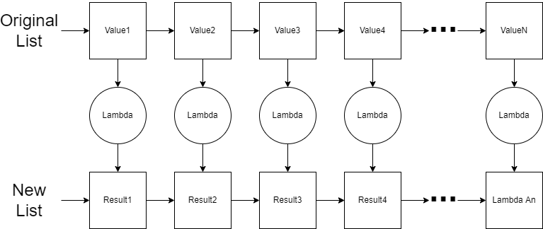

# Higher Order Functions - Map and Filter

The `map` and `filter` are common functions that are available in programming languages to simplify the process of processing a loop.  Frequently also simplified with a list comprehension syntax, these functions provide an introduction to a very common subset of functions Higher Order Functions.  A Higher Order Function is a function that takes a function as a parmater or returns a function as a result.

## Map

Let's consider the `map` function first.  The `map` converts a list to another list using a lambda function.  The lambda function defines how to convert each item in the original list to an item in the resulting list.



If I wanted to double all the values in the list, I would use the following lambda function:

:::: {.formulabox data-latex=""}
$spec ~ ~ \lambda : : a \rightarrow a.$

$de\mathit{f} ~ ~ \lambda :: Value \rightarrow Value * 2.$
::::
$\nonumber$

If I wanted to square of all values in the list, I would use the following lambda function 

:::: {.formulabox data-latex=""}
$spec ~ ~ \lambda :: a \rightarrow a.$

$de\mathit{f} ~ ~ \lambda :: Value \rightarrow Value * Value.$
::::
$\nonumber$

If I wanted to convert a list of strings to a list of string lengths, the lambda function would be (assuming you have a function called `length`):

:::: {.formulabox data-latex=""}
$spec ~ ~ \lambda :: string \rightarrow integer.$

$de\mathit{f} ~ ~ \lambda :: Text ~ ~ \rightarrow (length ~ ~ Text).$
::::
$\nonumber$

Notice that the `map` function is expecting that the lambda always have exactly 1 input parameter.  

Here is the formal definition of the `map`:

:::: {.formulabox data-latex=""}
$spec ~ ~ \lambda :: a_1 \rightarrow a_2.$

$spec ~ ~ map :: \lambda ~ ~ [a_1]\rightarrow [a_2].$

$de\mathit{f} ~ ~ map :: \lambda ~ ~ [] \rightarrow [];$

$de\mathit{f} ~ ~ map :: \lambda ~ ~ [First | Rest] \rightarrow [(\lambda ~ ~ First)|(map ~ ~ \lambda ~ ~ Rest)].$
::::
$\nonumber$

First thing to notice is that the `map` function does rely on the definition for $\lambda$.  Also notice the recursive nature of the `map` as it applies the lambda function to each element one at a time starting with the first element ($First$).  The result of ($\lambda ~ ~ First$) will be the new value that is placed in the resulting list.

Consider the code implementation in Erlang below.

```erlang
map(_Lambda, []) -> [];
map(Lambda, [First|Rest]) -> [Lambda(First)|map(Lambda, Rest)].
```
Notice that the `map` function doesn't know what the lambda will do except that it is a lambda that converts one value to another value.  Note that Erlang also has a built-in function `lists:map`.

:::: {.problembox data-latex=""}
**Problem Set 1**

You can find the template for the problem sets in this lesson here: [prove03.erl](proves/prove03.erl)

1. Implement the `map` function described above and write test code to convert a list of measurements in inches to a list of measurements in centimeters.  Use the formula $1 in = 2.54 cm$.  You will need to modify the test provided in the starting code.
2. Using the `map` function you wrote, use a simple cipher to encrypt a list of characters.  The simple cipher should shift all characters by 1 per the [ASCII table](https://www.asciitable.com/) .  For example, "PASSWORD" should be "QBTTXPSE".  In Erlang, a string is represented as a list of characters.  Therefore, you can list notation with strings.  Additionally, each character is treated as a number as shown in the ASCII table which means you can add numbers to letters.  You will need to modify the test provided in the starting code.
3. Rewrite the `map` function using a list comprehension and call the new function `map_2`.  Test the new `map_2` function in the same way as you tested `map` with the cipher test above.
::::

## Filter

The `filter` function converts a list to another list just like the `map` function.  However, the lambda function used by `filter` is intended to return a boolean result that will be used to determine if the value in the original list will be included in the new list.


If I wanted to include only even number values in my list, then the lambda function would be as follows:

:::: {.formulabox data-latex=""}
$spec ~ ~ \lambda :: integer \rightarrow boolean$

$de\mathit{f} ~ ~ \lambda :: Value \rightarrow Value ~ ~ mod ~ ~ 2 == 0.$
::::
$\nonumber$

If I wanted to include only three digit numbers, then the lambda function would be:

:::: {.formulabox data-latex=""}
$spec ~ ~ \lambda :: integer \rightarrow boolean.$

$de\mathit{f} ~ ~ \lambda :: Value \rightarrow Value \ge 100 ~ ~ and ~ ~ Value \le 999.$
::::
$\nonumber$

In both of these examples above, the lambda function is expected to return a boolean condition.  If it returns true, then the item will be included in the resulting list.

The formal definition of the `filter` is given below.  The implementation is left for an exercise. 

:::: {.formulabox data-latex=""}
$spec ~ ~ \lambda :: a \rightarrow boolean$

$spec ~ ~ \mathit{filter} :: \lambda ~ ~ [a] \rightarrow [a].$

$de\mathit{f} ~ ~ \mathit{filter} :: \lambda ~ ~ [] \rightarrow [];$

$de\mathit{f} ~ ~ \mathit{filter} :: \lambda ~ ~ [First | Rest] \rightarrow [First|(\mathit{filter} ~ ~ \lambda ~ ~ Rest)]  ~ ~ \text{when} ~ ~ (\lambda ~ ~ First) == true;$

$de\mathit{f} ~ ~ \mathit{filter} :: \lambda ~ ~ [First | Rest] \rightarrow (\mathit{filter} ~ ~ \lambda ~ ~ Rest).$
::::
$\nonumber$

In Erlang, we are limited to only boolean operations and sum built-in functions with the `when` guard. When we need to compare a computed result (in the case of the `filter` we need to run the lambda function and consider the result), you can use a `case` statement.  With a `case` statement, you can use `_Else` or just `_` to represent the default or otherwise case.  These `case` examples below provide a mechanism for traditional `if/else` conditional blocks.

```erlang
did_it_work(Number) ->
   Result = process_it(Number),
   % Use case to compare the value of a variable
   case Result of
      42 -> do_something(Number);
      _Else -> do_something_else(Number)
   end.

try_something_else(Number) ->
   Result = process_it(Number),
   % Use case to determine if a boolean expression is true
   case Number > 42 of
      true -> do_something(Number);
      _Else -> do_something_else(Number)
   end.
```
Note that Erlang provides this function as a built-in function called `lists:filter`.

:::: {.problembox data-latex=""}
**Problem Set 2**

1. Implement the `filter` function in Erlang.  Use a `case` block to determine whether an item in the list should be included.  Test the `filter` to get a list of even numbers from a list using the lambda described in the reading.  You will need to modify the test provided in the starting code.
2. Rewrite the `filter` function so that it uses a list comprehension instead of using the `case`.  Test the new function with the same lambda function in the previous problem.  Call the new function `filter_2`.
3. Use the `filter` functions you wrote to filter a list of temperatures (in Celsius) that will support liquid water (as opposed to frozen ice or boiling steam).
4. Use the `filter` function you wrote to filter a list of result strings that started with the prefix "ERROR:".  Consider using the `string:prefix` function to solve this problem.  You can learn more about that library function in the [Erlang Documentation for the string module](https://www.erlang.org/doc/man/string.html).
::::

## Functors

Our `map` function also has an additional classification.  A functor is a term from category theory in mathematics which means that it provides a mapping between two different categories of things.  In computer science, if we create a data structure that has the ability to change the contents without changing the structure, then we say that the structure is a functor.  The most common operation that we perform on functors is the `map` operation.  Remember that the `map` function will use a lambda to change all the contents of the list without changing the size of the list (i.e. the structure).  A tree is also a functor.  A binary search tree is a little more difficult.  If you apply a lambda on everything in the binary search tree, the ordering rules may be violated.  This means that the `map` function will have to check to see if re-ordering is needed.  Structures that represent a single item (e.g. variable of a certain type) can also be functors as a `map` function can be written for them to change their value using a lambda.  Even a function is a functor.  If you apply a lambda to a function then you have a new function which is a composition of both functions.  

Composition is a key characteristic of functors.  If the list is a functor, then I should be able to show that the following are equivalent given two lambdas $\lambda_g$ and $\lambda_h$:  

* `map` applied to a list using $\lambda_h(\lambda_g(x))$ which is the composition of both lambda functions
* `map` applied to a list using $\lambda_g(x)$ and then `map` applied a second time on that result using $\lambda_h$

We can write this as:

:::: {.formulabox data-latex=""}
$map(\lambda_h(\lambda_g),list) = map(\lambda_h,(map(\lambda_g,list)))$.  
::::
$\nonumber$

This is frequently written using composition notation: 

:::: {.formulabox data-latex=""}
$map(\lambda_h \circ \lambda_g) = map(\lambda_h) \circ map(\lambda_g)$. 
::::
$\nonumber$

This means that we can use the `map` on the functor list to either $\lambda_g$ and $\lambda_h$ combined (in order) or I can use the `map` on the functor list with $\lambda_g$ first and the use the `map` again using the $\lambda_h$ second.

Here is an example of demonstrating the composition rule for our list functor.  In the example, we will use $\lambda_g$ to double the value and use $\lambda_h$ to square and subtract 1.

:::: {.formulabox data-latex=""}
$spec ~ ~ \lambda_g :: a \rightarrow a.$
 
$de\mathit{f} ~ ~ \lambda_g ::  Value \rightarrow 2 * Value.$

$spec ~ ~ \lambda_h:: a \rightarrow a.$
 
$de\mathit{f} ~ ~ \lambda_h ::  Value \rightarrow (Value*Value) - 1.$
::::
$\nonumber$

To demonstrate the composition property, you will need to demonstrate that both side of the following is true:

:::: {.formulabox data-latex=""}
$map(\lambda_h \circ \lambda_g) = map(\lambda_h) \circ map(\lambda_g)$. 
::::
$\nonumber$

To solve the right hand side of the property, you will call the `map` function twice.  You will first call it on $\lambda_g$ and then take the result of that first `map` and use it in the second `map` with $\lambda_h$.  To solve the left hand size of the property, you will need to create a new function that composes $\lambda_h$ with $\lambda_g$.  Perhaps it can look something like:

```erlang
H_Compose_G = fun (X) -> H(G(X)) end,
```

You can now use `H_Compose_G` in your `map` call to evaluate the left hand size of the property.  If the resulting list on both side is the same, then we have successfully demonstrated the property.

The use of composition here is a preview for the topic of chaining which we will see in the near future.

:::: {.problembox data-latex=""}
**Problem Set 3**

1. Write code in Erlang to demonstrate composition property with the list functor.  You will not write your code in the test function.
  * Define your $\lambda_g$ as a function that doubles a value
  * Define your $\lambda_h$ as a function that squares a value and then subtracts 1
  * Implement $map(\lambda_g \circ \lambda_h)$ using the list of numbers in the test function.
  * Implement $map(\lambda_g) \circ map(\lambda_h)$ using the same list of numbers in the test function.
  * Verify that the result is the same.
::::

$\nonumber$
$\nonumber$
[](http://creativecommons.org/licenses/by/4.0/)
