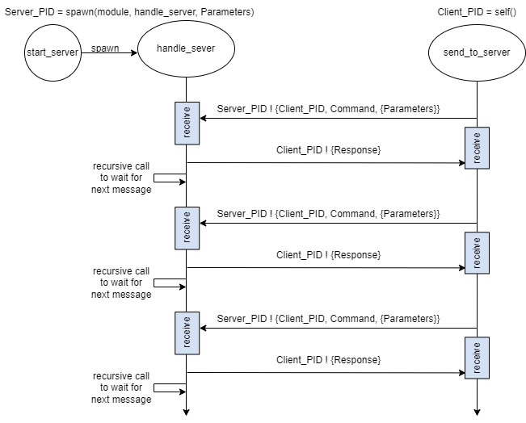

# Streams and Lazy Evaluation

In this lesson we will learn about the Stream Design Pattern.  Streams are things that provide you values when you need them.  They are an example of the unfold functor pattern.  This "lazy" approach can actually save you a lot of time and memory when you only need something one at a time.

## Streams

A stream provides information to us one item at a time whenever we need it.  This implies that when writing a stream, we need to consider two things:

* The user needs to provide a function to call to evaluate the next item in the stream.
* The function provided must be aware of the previous item.

Let's look at both of these needs separately.  If we wanted to provide the user with the ability to add 1 to a number at any time, we could write a function that returns a function to be called later.

:::: {.formulabox data-latex=""}
$spec ~ ~ lazy\_incr\_once :: integer \rightarrow (\lambda :: \rightarrow integer).$

$de\mathit{f} ~ ~ lazy\_incr\_once :: Value \rightarrow (\lambda :: \rightarrow Value + 1).$
::::
$\nonumber$

```erlang
lazy_incr_once(X) -> fun() -> X + 1 end.

test() ->
    L = lazy_incr_once(4),
    5 = L(),
    5 = L(),
    ok.
```
In the code above, we are running the function that was returned when we called `lazy_incr_once`.  It adds 1 to the original value 4 that was provided but never increases on subsequent calls.  We now combine this with the desire to have the function return something based on the previous result.  In the `lazy_incr` function, we will return two things: the next value and a brand new function to call to obtain the next value.  Notice that we are defining a custom data type called `iterator` which will contain both of these things.  Our ultimate goal by the next lesson is to define this as a Monad.

:::: {.formulabox data-latex=""}
$struct ~ ~ iterator ~ ~ \lbrace a, \lambda_{stream} \rbrace.$

$spec ~ ~ \lambda_{stream} :: \rightarrow iterator.$

$spec ~ ~ lazy\_incr :: integer \rightarrow \lambda_{stream}.$

$de\mathit{f} ~ ~ lazy\_incr :: Value \rightarrow (\lambda_{stream} :: \rightarrow \lbrace (Value + 1), (lazy\_incr ~ ~ (Value + 1)) \rbrace).$
::::
$\nonumber$

```erlang
lazy_incr(Value) -> fun() -> {Value + 1, lazy_incr(Value+1)} end.

test() ->
    L = lazy_incr(4),
    {5, L2} = L(),
    {6, L3} = L2(),
    {7, L4} = L3(),
    ok.
```

Another classic stream is the range function which will provide a sequence of numbers but only one at a time.  In this function, we will assume that the sequence will go from `Start` to `Stop`, inclusive and that `Start <= Stop`.  Unlike the previous example, this iterator will need to stop.  We will modify our new `fixed_iterator` to have other possible values.

:::: {.formulabox data-latex=""}
$struct ~ ~ \mathit{f}ixed\_iterator$

$\quad \quad \lbrace a, \lambda_{stream} \rbrace ~ ~ or$

$\quad \quad \lbrace atom(unde\mathit{f}ined), atom(done) \rbrace.$

$spec ~ ~ \lambda_{stream} :: \rightarrow \mathit{f}ixed\_iterator.$

$spec ~ ~ range :: integer ~ ~ integer \rightarrow \lambda_{stream}.$

$de\mathit{f} ~ ~ range :: Start ~ ~ Stop \rightarrow (\lambda_{stream} :: \rightarrow \lbrace Start, (range ~ ~ (Start+1), Stop) \rbrace )$

$\quad \quad \text{when} ~ ~ Start \leq Stop;$

$de\mathit{f} ~ ~ range :: Start ~ ~ Stop \rightarrow (\lambda_{stream} :: \rightarrow \lbrace undefined, done \rbrace).$
::::
$\nonumber$

The erlang code is given below:

```erlang
range(Start, Stop) when Start =< Stop ->
	fun () -> {Start, range(Start+1, Stop)} end;
range(_Start, _Stop) ->
	fun () -> {undefined, done} end.
```
We can simplify the above code by moving the guards into the anonymous function as shown below:

```erlang
range(Start, Stop) ->
	fun () when Start =< Stop -> {Start, range(Start+1, Stop)};
		() -> {undefined, done} end.
```

An example of the test code using the `range` function is given below.  Notice that the value of `{undefined, done}` is returned when the stream is completed.

```erlang
test() ->
	Stream1 = range(1,4),
	{1, Stream2} = Stream1(),
	{2, Stream3} = Stream2(),
	{3, Stream4} = Stream3(),
	{4, Stream5} = Stream4(),
	{undefined, done} = Stream5(),
	ok.
```

:::: {.problembox data-latex=""}
**Problem Set 1**

You can find the template for the problem sets in this lesson here: [prove07.erl](proves/prove07.erl)

1. Modify the `range` function to take a third parameter called `Step`.  You should increase the sequence by the amount of `Step`.  If the `Step` is negative, then create a decreasing sequence.  If the `Step` is 0, then the `done` state should occur immediately.  Test code is provided to test your stream.
2. Create a new stream called `words` which will split text by spaces into sub-strings.   Each time the stream is called, it should return back the next string.  For example, if the text was "The cow jumped over the moon.", then the stream would first return "The", then "cow", then "jumped", and so forth.  Use the same `fixed_iterator` type described above.  You are provided a function called `first_word` which returns a tuple in the format `{Word, Rest}` where `Word` is the first word and `Rest` is the remaining text (just like working with values in a list).  Test code is provided to test your stream.
::::

## Stream Monad & Collection

In the previous section we created a `fixed_iterator` type that the `range` function supported.  This type is actually a Monad.  The $\lambda_{stream}$ provided in the `fixed_iterator` is the meta-data or state that we are maintaining for our stream. To complete the Monad definition, we need a type constructor (or unit function) and a bind function.  Since the type constructor will need to create a stream that hasn't started yet, we will modify our specification for the Monad Type we had earlier (the second condition in the struct is new):

:::: {.formulabox data-latex=""}
$struct ~ ~ \mathit{f}ixed\_iterator$

$\quad \quad \lbrace a, \lambda_{stream} \rbrace ~ ~ or$

$\quad \quad \lbrace atom(unde\mathit{f}ined), \lambda_{stream} \rbrace ~ ~ or$

$\quad \quad \lbrace atom(unde\mathit{f}ined), atom(done) \rbrace.$

$spec ~ ~ \lambda_{stream} :: \rightarrow \mathit{f}ixed\_iterator.$
::::
$\nonumber$

The type constructor should be used to create the iterator the first time.  We will call our type constructor `iter`.  The `iter` will take as an input a $\lambda_{stream}$ function (the function that is returned by our `range` function or any other stream).  The `iter` will produce the $\lbrace atom(unde\mathit{f}ined), \lambda_{next} \rbrace$.  This is the state of our iterator before we actually start the iteration.

:::: {.formulabox data-latex=""}
$spec ~ ~ iter :: \lambda_{stream} \rightarrow \mathit{f}ixed\_iterator.$

$de\mathit{f} ~ ~ iter :: \lambda_{stream} \rightarrow \lbrace unde\mathit{f}ined, \lambda_{stream} \rbrace.$
::::
$\nonumber$

The bind should allow us to take our `fixed_iterator` (the Monad type returned by the `iter` function) and pass it to our stream function which will return an updated `fixed_iterator`.  Remember that our stream function is always regenerated and has no input parameters.  The next function is re-created each time with the next value built-into the function.  We will call our bind function `next` and it will be responsible for getting the next stream iteration.  Unlike previous bind functions we have used, this bind will not take a function parameter because we will limit the application of this bind function only to our $\lambda_{stream}$ function.

:::: {.formulabox data-latex=""}
$spec ~ ~ next :: \mathit{f}ixed\_iterator \rightarrow \mathit{f}ixed\_iterator.$

$de\mathit{f} ~ ~ next :: \lbrace Value, done \rbrace \rightarrow \lbrace unde\mathit{f}ined, done \rbrace;$

$de\mathit{f} ~ ~ next :: \lbrace Value, \lambda_{stream} \rbrace \rightarrow (\lambda_{stream}).$
::::
$\nonumber$

Using these specifications and definitions, we can complete the `fixed_iterator` Monad along with helper functions (`value` and `lambda`) to access both parts of our Monad type.

```erlang
iter(Stream) -> {undefined, Stream}.

next({_Value,done}) -> {undefined, done};
next({_Value,Lambda}) -> Lambda().

value({Value,_Lambda}) -> Value.
lambda({_Value,Lambda}) -> Lambda.
```

We can use our new functions and show that calling our bind function `next` will result in `undefined` if we complete our iterator.

```erlang
Next1 = next(iter(range(1,4))),
io:format("~p~n",[value(Next1)]),  % Print 1
Next2 = next(Next1),
io:format("~p~n",[value(Next3)]),  % Print 2
Next3 = next(Next2),
io:format("~p~n",[value(Next3)]),  % Print 3
Next4 = next(Next3),
io:format("~p~n",[value(Next4)]),  % Print 4
Next5 = next(Next4),
io:format("~p~n",[value(Next5)]),  % Print undefined
Next6 = next(Next5),
io:format("~p~n",[value(Next6)]),  % Print undefined
```

A common function that is implemented when lazy streams are supported is the `collect`.  The `collect` function will undo the "laziness" of our data structure by iterating through the entire $\lambda_{stream}$ and put all the results in order into a traditional list.  This `collect` function is an example of the unfold functor pattern.

The specification for the `collect` is given below:

:::: {.formulabox data-latex=""}
$spec ~ ~ collect :: \lambda_{stream} \rightarrow [a].$

$spec ~ ~ collect :: \lambda_{stream} ~ ~ [a] \rightarrow [a].$
::::
$\nonumber$

The second specification is intended to help build the list result recursively by calling the `next` function until the iterator is completed.  The definition for the first specification for `collect/1`is given below.  Notice that the function will call `iter` to convert the $\lambda_{stream}$ into a `fixed_iterator` prior to doing the recursion to generate the list of values.

:::: {.formulabox data-latex=""}
$de\mathit{f} ~ ~ collect :: Stream \rightarrow (collect (iter ~ ~ Stream) ~ ~ []).$
::::
$\nonumber$

The erlang code for `collect/1` is given below:

```erlang
collect(Stream) -> collect(iter(Stream), []).
```
The implementation of the `collect/2` function is left for an exercise below.

:::: {.problembox data-latex=""}
**Problem Set 2**

1. Implement the `collect/2` function and test it with the code provided.  When writing the function, you should reuse the `next` function iterate the stream, reuse the `value` function to get the  value to put in the `Result` list, and reuse the `lambda` function to compare with `done`.  Test code using the `collect` function with `range` and `words` is provided.
::::

## Erlang Processes & Streams

Another common problem solved with streams is a unique ID generator.  We could write the same code above to obtain a function that will return the next available number  (i.e. prev number + 1).  However, if we had multiple software components that needed to use the same unique ID generator, then we need a slightly different approach.  

Erlang supports a scalable process system that allows for safe concurrent operations.  This process system can be used locally with our software or it can be used along with networking code to support communication between different machines.

The diagram below shows how a client/server process architecture can be setup in Erlang.  We will assume in our discussion that both the client and the server are running locally on our same machine. 



In the diagram above, we have a process that is started (or spawned) by `start_server` and handles messages received by `handle_server`.  The client uses the server process ID (PID) to send messages to the server and then waits for a response.  All messages sent to the server are formatted as follows: 

:::: {.formulabox data-latex=""}
$\lbrace Client\_PID, Command, \lbrace Parameters \rbrace \rbrace$ 
::::
$\nonumber$

Responses back to the client are formatted as follows:

:::: {.formulabox data-latex=""}
$\lbrace Response \rbrace$
::::
$\nonumber$

This simple server has only two commands:

* echo - Send the text back to the client
* add - Add the two numbers and send back the answer to the client.

The server can handle only one request at a time.  After the server handles the request, the `handle_server` function is called again to handle the next request.  This ability to handle only one thing at a time will help us create the unique ID server later on.  Let's first look at the Erlang code needed:

```erlang
handle_server() ->
	receive
		{Client_PID, echo, {Text}} -> Client_PID ! {Text};
		{Client_PID, add, {X, Y}} -> Client_PID ! {X+Y}
	end,
	handle_server().

start_server() ->
	spawn(prove07, handle_server, []).
 
send_to_server(Server_PID, Command, Params) ->
	Server_PID ! {self(), Command, Params},
	receive
		{Response} -> Response
	end.
```
The `start_server` function will spawn a new process.  When spawning a new process, the handler function is specified along with its module name and a list of any parameters.  In this simple example, there are no parameters.  Note that you have to export the `handle_server` function for the `spawn` function to work properly.

The `handle_server` function uses the `receive` command to receive a message from a client.  When one is received and matches one of the patterns in the `receive` command block, then a response is sent back.  In Erlang, a message is sent using the syntax: `PID ! Message`.  We use the Client PID that we received to send the response back.  The call to `handle_server` recursively at the end will allow the server to response to the next client.

The `send_to_server` function is a utility function to help us send a message to server and receive the response.  When sending messages to the server, the Erlang function `self()` is called to obtain the client PID to send to the server.   A test example is shown below:

```shell
2> Server_PID = prove07:start_server().
<0.85.0>
3> prove07:send_to_server(Server_PID, echo, {"Hello"}).
"Hello"
4> prove07:send_to_server(Server_PID, add, {13, 8}).    
21
5>
```

If we wanted to create a unique ID server following this same format, we can modify our handler function to take a parameter that keeps track of the current ID.  Remember that each call to the handler function is guaranteed to handle only one client at a time.  Similar to the concept of the stream functions being created with the next value in the stream, our handler will create the next value to be used.

Here is the code for our new `start_id_server` and `handle_id_server`.  Notice that the `handle_id_server` now has an input parameter and it is initialized in the spawn function within `start_id_server`.   For the `export`, notice that we specify the arity: `handle_id_server/1`.

```erlang
-export([handle_id_server/1]).

handle_id_server(Curr_ID) ->
	receive
		{Client_PID, id, {}} -> Client_PID ! {Curr_ID}
	end,
	handle_id_server(Curr_ID + 1).

start_id_server() ->
	spawn(prove07, handle_id_server, [0]).
```

When the `handle_id_server` is called recursively to handle the request from the next client, the `Unique_ID` is incremented by 1.

Reusing the same `send_to_server` function, we can generate new unique ID's as follows starting with 0.

```shell
5> ID_Server_PID = prove07:start_id_server(). 
<0.89.0>
6> prove07:send_to_server(ID_Server_PID, id, {}).       
0
7> prove07:send_to_server(ID_Server_PID, id, {}).
1
8> prove07:send_to_server(ID_Server_PID, id, {}).
2
9> prove07:send_to_server(ID_Server_PID, id, {}).
3
10> prove07:send_to_server(ID_Server_PID, id, {}).
4
11> prove07:send_to_server(ID_Server_PID, id, {}).
5
12> 
```

:::: {.problembox data-latex=""}
**Problem Set 3**

1. Modify the `handle_server` function to support an `avg` command that will average a variable collection of numbers.  For example, if the parameters field is `{10,20,30,40}` then 25 will be returned back to the client.  You can use the Erlang `lists:sum` and `length` functions.
2. Create a server based on the Unique ID server but with functions called `handle_running_avg_server` (remember that this one needs to be exported) and `start_running_avg_server` that maintains a running average of numbers submitted.  There should be three commands:
	* add - Adds a number to the running average and returns the current average
	* remove - Removes a number from the running average and returns the current average
	* display - Returns the current average
	
	When implementing the running average server, you should save the current sum and current number of numbers in your server.  You should not store the list of numbers.  Additionally, you don't have to consider error scenarios that would lead to divide by 0.  Test code is provided for you.
::::

$\nonumber$
$\nonumber$
[](http://creativecommons.org/licenses/by/4.0/)
