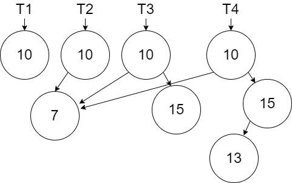
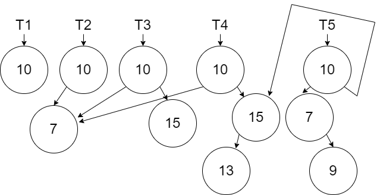
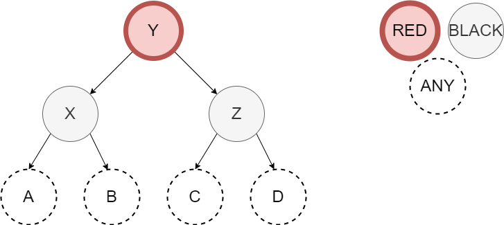

# Trees

In this lesson we will learn about our second data structure called the Binary Search Tree.  When we learned about persistence we learned about the list as it is implemented in Erlang.  When we learned about monads, we introduced a new version of the list which was created using our own custom tuples.  The Binary Search Tree will use this same custom approach.

## Binary Search Tree

A binary search tree is a tree that stores smaller values to the left and larger values to the right.  Each node in the tree in defined by 3 fields: value, link to the left sub-tree, and link to the right sub-tree.

The tree is useful because we can quickly search for values by asking ourselves, "is the value we are looking for larger or smaller (or maybe we found it) than the one in the current node of the tree?"  This is like guessing a number between 1 and 100 and always guessing 50 first.  Searching in the tree will ideally exclude half of the values with each comparison.  We will explore this "ideal" performance in the next part of the lesson.

Persistence is a curious thing to consider visually with the tree.  In the diagram below, we show the creation of a tree with one node valued 10 called $T_1$ .


When we add a new node with value 7 (in this case something that will go left of the root node), we must persist $T_1$.  Since the left link in the root node must change, then we need a new node to create $T_2$.


If we now add a node with value 15 to the right of the root node, we are only affecting the right link.  The new node we created in the previous step can be reused in creating $T_3$.


In the next diagram we show the creation of $T_4$ by adding the new node with value 13.



In the next diagram we show the creation of $T_5$ by adding the new node with value 9.



Finally, we show the creation of $T_6$ by adding the new new node 5.


The software will discard older versions of the Tree when they are not needed anymore.  However, the persistence we use in the data structure is important to satisfy the immutability rules.

Notice that the there is always a path through the tree that we have to re-create from the root node down to the node that we added.  When we reuse a node in the tree, we will reuse both the node and all the nodes it is connected too.  We will not have to have to use recursion when we reuse a node.

Let's begin with the structure of the node:

:::: {.formulabox data-latex=""}
$struct ~ ~ node ~ ~ \lbrace a:Value, node:\mathit{Left}, node:Right \rbrace.$
::::
$\nonumber$

We will implement two functions in our binary search tree.  The `add` function will add a value to the tree and the `contains` function will search the tree for a value and return a true or false.  When we add to a tree or we search in a tree, we will do so recursively through nodes beginning with the root node.  When we add to a tree, the result will be an updated root node (or an updated sub-tree root node as we recursively create our new tree).

:::: {.formulabox data-latex=""}
$spec ~ ~ add :: a ~ ~ node \rightarrow node.$

$spec ~ ~ contains :: a ~ ~ node \rightarrow boolean.$
::::
$\nonumber$

In our specification, we are assuming that $a$ represents a type that can be compared with boolean operators.

There are 4 scenarios when adding a new item to a tree:

* Empty Tree - Create a new root `node`.  We will define an empty tree as `nil`.
* Value to add is less than the current node value - Create a new `node` reusing the right link.  The left link is created by recursively calling `add` on the left sub-tree.
* Value to add is greater than the current node value - Create a new `node` reusing the left link.  The right link is created by recursively calling `add` on the right sub-tree.
* Value to add is equal to the current node value - In our tree, we will require all values to be unique.  In this case, we get to reuse the entire node including both left and right links.  The tree can be implemented differently by allowing duplicates perhaps stored to the right.

The definition for `add` is given below.  The implementation for both `add` and `contains` will be left for an exercise.

:::: {.formulabox data-latex=""}
$\mathit{def} ~ ~ add :: New\_Value ~ ~ nil \rightarrow \lbrace New\_Value, nil, nil \rbrace;$

$\mathit{def} ~ ~ add :: New\_Value ~ ~ \lbrace Value, Left, Right \rbrace  \rightarrow \lbrace Value, (add ~ ~ New\_Value ~ ~ Left), Right \rbrace$

$\quad \quad \text{when} ~ ~ New\_Value < Value;$

$\mathit{def} ~ ~ add :: New\_Value ~ ~ \lbrace Value, Left, Right \rbrace \rightarrow \lbrace Value, Left, (add ~ ~ New\_Value ~ ~ Right) \rbrace$

$\quad \quad \text{when} ~ ~ New\_Value > Value;$

$\mathit{def} ~ ~ add :: New\_Value ~ ~ Node \rightarrow Node.$
::::
$\nonumber$

:::: {.problembox data-latex=""}
**Problem Set 1**

You can find the template for the problem sets in this lesson here: [prove08.erl](proves/prove08.erl)

1. Implement the `add` function per the specification and definition above.  Use the test code provided.
2. Implement the `contains` function per the specification above.  Use the test code provided.
::::

## Balanced Red-Black Tree

Since a binary search tree is ordered relative to the values, traversing the tree (either to insert or find) can provide an O(log n) performance.  However, this can only be achieved if the tree is balanced.  If we added the numbers 1, 2, 3, 4, 5, 6, 7 in order to a tree, they would all be added to the right as shown below.  Searching for a number in the tree would be the same as searching a list which is O(n)


However, if the numbers were added 4, 2, 6, 1, 3, 5, 7 then we would get a tree that allows for the maximum exclusion of values every time we go left or right.


Since we can't rely on the order of the data, there are other  strategies and algorithms that can be used.  A common one is the Red Black Tree (RBT).  The RBT uses a set of rules to determine if part of a tree is unbalanced.  If something is unbalanced, a modification is made to balance the tree.  In other words, after the creation of any node in the `add` function, we will potentially perform a `balance` function.  

The rules for an RBT are as follows:

1. Every node is either red or black - In our algorithm we will choose to start all nodes red.
2. The root is always black - In our algorithm we will choose to change the root node to black after the inserting and all balancing is completed.
3. No two adjacent nodes are red.
4. Every path from a node to a leaf has the same number of black nodes.

In our algorithm we will enforce rules and 3 and 4 with our balancing function.

To support these rules, the structure of the node must change to include the color of the node:

:::: {.formulabox data-latex=""}
$struct ~ ~ node$

$\quad \quad \lbrace atom(red), a:Value, node:\mathit{Left}, node:Right \rbrace ~ ~ or$

$\quad \quad \lbrace atom(black), a:Value, node:\mathit{Left}, node:Right \rbrace.$
::::
$\nonumber$

We will use the function names `add_rbt` and `contains_rbt` so they are unique from the traditional binary search tree.  The `contains_rbt` is the same as `contains` as the color is only important for adding and therefore is unused in the `contains_rbt`.

The `add_rbt` function is very similar to the `add` with the following distinctions:

* When we create a new node we color it red
* When we create a new node that reuses one link and recursively adds the node on the other link, we need to call a `balance` function (discussed later) on the new node we created.
* When we are done adding the node, we need to change the root node to be black.  This will necessitate an additional helper function.  The `add_rbt` will call `add_rbt_` which will do most of the work.  When `add_rbt_` is done, `add_rbt` will force the root node to be black.

The specification and definition for the `add_rbt` and `add_rbt_` are shown below:

:::: {.formulabox data-latex=""}
$spec ~ ~ add\_rbt :: a ~ ~ node \rightarrow node.$

$\mathit{def} ~ ~ add\_rbt :: New\_Value ~ ~ Tree \rightarrow$

$\quad \quad New\_Root = (add\_rbt\_ ~ ~ New\_Value ~ ~ Tree),$

$\quad \quad \lbrace black, New\_Root.Value, New\_Root.\mathit{Left}, New\_Root.Right \rbrace.$
::::
$\nonumber$

:::: {.formulabox data-latex=""}
$spec ~ ~ add\_rbt\_ :: a ~ ~ node \rightarrow node.$

$\mathit{def} ~ ~ add\_rbt\_ :: New\_Value ~ ~ nil \rightarrow \lbrace red, New\_Value, nil, nil \rbrace;$

$\mathit{def} ~ ~ add\_rbt\_ :: New\_Value  ~ ~ \lbrace Color, Value, \mathit{Left}, Right \rbrace \rightarrow$

$\quad \quad (balance ~ ~ \lbrace Color, Value, (add\_rbt\_ ~ ~ New\_Value ~ ~ \mathit{Left}), Right \rbrace) ~ ~$

$\quad \quad \text{when}  ~ ~ New\_Value < Value;$

$\mathit{def} ~ ~ add\_rbt\_ :: New\_Value ~ ~ \lbrace Color, Value, \mathit{Left}, Right \rbrace \rightarrow$

$\quad \quad (balance ~ ~ \lbrace Color, Value, Left, (add\_rbt\_ ~ ~ New\_Value ~ ~ \mathit{Right}) \rbrace) ~ ~$

$\quad \quad \text{when} ~ ~ New\_Value > Value;$

$\mathit{def} ~ ~ add\_rbt\_ :: New\_Value ~ ~ Node \rightarrow Node.$
::::
$\nonumber$

The `balance` function that is being performed is based on pattern matching defined by an algorithm written by Chris Okasaki (reference Purely Functional Data Structures).  In his algorithm, there are four unbalanced scenarios that need to be balanced.  These adjustments are made when the `add_rbt_` function is returning from all the recursive calls back up to the new root.  The diagram below shows the four scenarios.


The selection of variables in these diagrams was purposeful to suggest that $X < Y < Z$.  We need code to look for each of these four scenarios.  If we have any of these four, then the solution is the same shown below.



The specification for our balance is simple as it converts a potentially unbalanced node into a balanced node:

:::: {.formulabox data-latex=""}
$spec ~ ~ balance :: node \rightarrow node.$
::::
$\nonumber$

The definition for this function has 5 clauses (one for each scenario plus one in case none of them match.  The first clause below corresponds to scenario 1.  The next three scenarios are left for an exercise.  The default clause is also given below.

:::: {.formulabox data-latex=""}
$\mathit{def} ~ ~ balance :: \lbrace black, Z, \lbrace red, X, A, \lbrace red, Y, B, C, \rbrace \rbrace, D \rbrace) \rightarrow$

$\quad \quad \lbrace red, Y, \lbrace black, X, A, B \rbrace, \lbrace black, Z, C, D \rbrace \rbrace;$

$\mathit{def} ~ ~ balance :: \text{Scenario 2 left for an exercise};$
 
$\mathit{def} ~ ~ balance :: \text{Scenario 3 left for an exercise};$
 
$\mathit{def} ~ ~ balance :: \text{Scenario 4 left for an exercise};$
 
$\mathit{def} ~ ~ balance :: Node \rightarrow Node.$
::::
$\nonumber$

The Erlang code for the definitions provided above is given below.  The remaining code is left for an exercise.

```erlang
balance({black,Z,{red,X,A,{red,Y,B,C}},D}) -> {red,Y,{black,X,A,B},{black,Z,C,D}};
% Scenarios 2, 3, and 4 are left for an exercise
balance(Node) -> Node.
```

:::: {.problembox data-latex=""}
**Problem Set 2**

1. Complete the add functionality for the RBT.  The `add_rbt` function is written for you and you need to write the `add_rbt_` as described in the specification and definition above.  Implement the `add_rbt_` function per the specification and definition above.  You will also need to finish implementing the `balance` function for cases 2, 3, and 4 per the diagrams above.  Use the test code provided.
2. Implement the `contains_rbt` function per the specification below.  Note that while color is used in the RBT, the color is left unused by the `contains_rbt` function.  Use the test code provided.

:::: {.formulabox data-latex=""}
$spec ~ ~ contains\_rbt :: a ~ ~ node \rightarrow boolean.$
::::
$\nonumber$

::::

## Performance

The binary search tree from Part 1 has performance of O(log n) if its balanced but as it becomes unbalanced, it becomes O(n).  The RBT from Part 2 has performance of O(log n) because it maintains the balanced state.  Even though there is more work needed to balance, it is offset by ability to find the spot for new nodes because its balanced.

To compare the performance of both approaches for a tree with 10,000 nodes in the problem set below, we will use the `eprof` library in Erlang.  This library will report the number of times a function runs and the execution time of those functions.  As with tools like these, there is an overhead cost for running `eprof` but it will not prevent us from making observations.

The following utility functions can be put around code to display performance results.

```erlang
start_perf() ->
	eprof:start_profiling([self()]).

stop_perf(Title) ->
	io:format("Perf (~p): ~n",[Title]),
	eprof:stop_profiling(),
	eprof:analyze(total).
```
If we wanted to compare the cost of adding to the front of a list and the cost of adding to the end of list, we would create a single `foldl` to perform those operations using a sequence of numbers from 1 to 10,000.

```erlang
% Code to test
prepend(Value, List) -> [Value|List].

append(Value,[]) -> [Value];
append(Value,[First|Rest]) -> [First|append(Value,Rest)].

timing_test() ->
	List = lists:seq(1,10000),
	
	start_perf(),
	lists:foldl(fun prepend/2, [], List),
	stop_perf("prepend"),

	start_perf(),
	lists:foldl(fun append/2, [], List),
	stop_perf("append"),

	ok.
```

The code will take several seconds to run.  The output of `eprof` will include your functions and several others.  Sample output (results will vary on different computers) of `eprof` for this code including only the functions we are testing is given below:

```shell
Perf ("prepend"):
FUNCTION                          CALLS        %  TIME  [uS / CALLS]
--------                          -----  -------  ----  [----------]
prove08:prepend/2                 10000    22.91  1126  [      0.11]
--------------------------------  -----  -------  ----  [----------]
Total:                            32524  100.00%  4914  [      0.15]

Perf ("append"): 
FUNCTION                             CALLS        %     TIME  [uS / CALLS]
--------                             -----  -------     ----  [----------]
prove08:append/2                  50005000    99.94  9867673  [      0.20]
--------------------------------  --------  -------  -------  [----------]
Total:                            50027524  100.00%  9873713  [      0.20]
```

We can see that the `prepend` was much faster taking about 1 millisecond versus `append` taking almost 10 seconds.  The cost of each call wasn't too much different.    The `append` was plagued by all the recursive calls to add the item to the end of the list.  We can see the O(n^2^) behavior of `append` when add `n` items.

:::: {.problembox data-latex=""}
**Problem Set 3**

1. Compare the performance of the Binary Search Tree (`add` and `contains`) and the Red Black Tree (`add_rbt` and `contains_rbt`).  Use the `start_perf` and `stop_perf` functions to add up the total time using these functions (remember that `add_rbt` uses `add_rbt_` and `balance` as well).   Add the numbers 1 to 10,000 (the list is already provided to you in the test code) to both data structures in order using a `foldl`. This will result in the worst unbalanced tree using `add`.  Do a search for the value 10,000 to force the largest search for both `contains` and `contains_rbt`).  Compare the performances for our 4 functions and explain what you found.
::::

$\nonumber$
$\nonumber$
[](http://creativecommons.org/licenses/by/4.0/)
