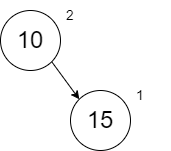
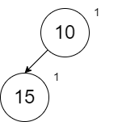
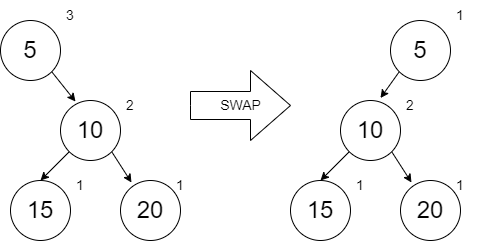
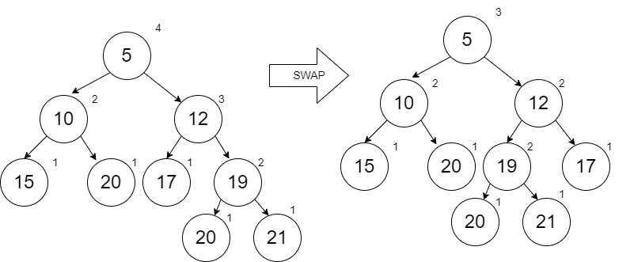
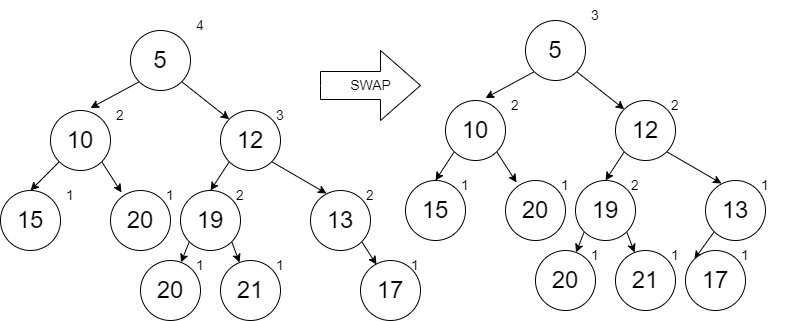

# Min Heaps

In this lesson we will learn about Min Heaps.  The Min Heap has two components to it:  a minimum value easily accessible at the root and a "heap" of everything else below it in the form of a tree.  There is a strategy for that heap of values which we will explore in the material below.

## Min Heap

The diagram below shows a Min Heap.  More specifically its a "Leftist" Min Heap since in all cases we have favored putting items on the left thus keeping the right "spine" of the tree as short as possible (within the algorithm requirements which we will learn about shortly).  


When we look at this Min Heap, we see three characteristics:
1. The smallest value is in the root node
2. The values along each right spine (both from the root and from other nodes) are sorted.  
3. For each node, the length of the right spine from the left and right links are such that the one on the left is greater than or equal to the one of the right.  For example, if you look at node 12, the left side (node 19) has a distance of 2 on the right spine (following 19 and 21) and the right side (node 13) has a distance of 1 on the right spine (following only 13).  We call this distance, the "rank".

If we want to add items to this Min Heap, we are going to add them in order along the right spine starting with the root node.  When we insert in the node, we will need to work our way back up the tree and check to make sure we have not violated our need to have the left rank be greater than or equal to the right rank.  If there is a problem, the solution is to just swap the left with the right.

Before we look at specifications, definitions, and code, we will first build a Min Heap by adding the following numbers in order (same values you will find in the test code for the problem set):  10, 15, 20, 5, 12, 17, 19, 20, 21, 13, 8, and 1.  As you look at this list of numbers, note that we will have some interesting results at various times.  For example, when add the 5 and the 1 we will be replacing the root node since the root node must contain the minimum value.  Also, when we add 13, we will be replacing along the right spine from the root since the right spine from any node must be in order.  In all of these operations, remember that we are persisting previous versions of the min heap.  

The addition of our first node 10 is trivial since the min heap is empty.  In each of these diagrams, we will show the rank on the upper right of the circle.


The addition of 15 will require us to compare it with 10 (the first only value on the right spine from the root).  When we insert, we will always insert to the Right.  When we get to the case that we are inserting in the middle of the spine, we will keep the left of our new node empty and the right of the new node will be the remainder of the spine unchanged.  



When we look at this min heap, notice that the rank on the right side is 1 and the left hand side is empty which implies a rank of 0.  This means we need to swap left and right.  The diagram below is correct.



When we add 20, we have a spot and no swapping is needed.


When we add 5, our first comparison shows that 5 should be before 20 on the right spine.  When adding a new node to anywhere but the end of the spine, we will leave the left link empty and the right link will be the remainder of the spine unchanged.  After doing this, we work our way back up (not too far in this case) to check ranks.  We don't check the ranks of the spine that we left unchanged.  The ranks at node 5 show that we need to swap.



When we add 12, it can be done with no swapping.


When we add 17, we start our comparisons with the node that we added (which is no issues because its at the end) and then work our way up the spine comparing ranks.  At the 12, we see a need to swap.


When we add the 19, it can be done with no swapping.


When we add the 20, it can also be done with no swapping.  Notice that there was no problem adding this duplicate.  If the duplicate was the root node already, we could choose to replace it with our new value and push the duplicate down (all depends on how we write our boolean comparison).


When we add the 21, we find that the node 12 has a need to swap.



When we add the 13 (which occurs between 12 and 17), a swap occurs with node 13.



When we add the 8, we have to add it within the spine after the 5.  When we do this, the rest of the spine is put to the right of our new node 8.  Starting with node 8, we see the rank of node 12 is higher than the empty left side of 8.  A swap is required.  Notice as we do this that the right spine from the root is remaining minimized and sorted.  This makes it faster to insert new items.


Finally, when we add the 1, it has to be added at the root, so the entire tree becomes the right link from the new 1 node.  The ranks require us to swap and now we end of with a min heap that has nothing on the right side at all.  This means inserting the next thing will be really fast and the minimum is easily accessible at the root still.


After reviewing this process, you should be able to envision the specification and design.  We will be doing this in 2 steps.  First, we will implement the inserting along the right spine but without swapping.  The swapping will be done in the next section.  We will define a structure that includes rank.  We again are assuming that the data type $a$ for the value is something that can be compared with boolean operators.

:::: {.formulabox data-latex=""}
$struct ~ ~ node ~ ~ \lbrace integer:Rank, a:Value, node:\mathit{Left}, node:Right \rbrace.$

$spec ~ ~ insert :: a ~ ~ node \rightarrow node.$
::::
$\nonumber$

To support our definitions that we will discuss below, we have two helper functions (which will be more helpful as we explore this more).  The `rank` function gives us a value of 0 when no node exists (`nil`).  The `make` function will create the node with an updated rank value.  Note that the distance along the right spine is always the rank of the right node plus one (representing the new node we are creating).

:::: {.formulabox data-latex=""}
$spec ~ ~ rank :: node \rightarrow integer.$

$spec ~ ~ make :: a ~ ~ node ~ ~ node \rightarrow node.$

$\mathit{def} ~ ~ rank :: nil \rightarrow 0;$

$\mathit{def} ~ ~ rank :: \lbrace Rank, Value, \mathit{Left}, Right \rbrace \rightarrow Rank.$

$\mathit{def} ~ ~ make :: Value ~ ~ \mathit{Left} ~ ~ Right \rightarrow \lbrace (rank ~ ~ Right) + 1, Value, \mathit{Left}, Right \rbrace.$
::::
$\nonumber$

In the definition for `insert`, the first clause is for the case that we have reached the end of the spine (or the heap was empty to begin with).  The second clause handles the case where we have found a place to insert along the spine.  In this second case, we are keeping the entire remaining heap (`Node`) on the right of our new node.  The third clause handles the case where we are still looking.  In this last case, we are keeping the left link of the heap unchanged as we go.

:::: {.formulabox data-latex=""}
$\mathit{def} ~ ~ insert :: New\_Value ~ ~ nil \rightarrow (make ~ ~ New\_Value ~ ~ nil ~ ~ nil);$

$\mathit{def} ~ ~ insert :: New\_Value ~ ~ Node \rightarrow (make ~ ~ New\_Value ~ ~ nil ~ ~ Node)~ ~$

$\quad \quad \text{when} ~ ~ New\_Value \leq Node.Value;$

$\mathit{def} ~ ~ insert :: New\_Value ~ ~ Node \rightarrow (make ~ ~ Node.Value ~ ~ Node.\mathit{Left} ~ ~$

$\quad \quad (insert ~ ~ New\_Value ~ ~ Node.Right)).$
::::
$\nonumber$

:::: {.problembox data-latex=""}
**Problem Set 1**

You can find the template for the problem sets in this lesson here: [prove09.erl](proves/prove09.erl)

1. Implement the `insert` function per the specification and definition given above.  The `rank` and `make` functions are written for you.  Use the test code provided to test your function.  Note that at this point, the algorithm has not done any swapping.  That will be done in the next section below.  When implementing this in Erlang, you may want to take advantage of some additional syntax.  Up to this point, there are two ways you know to write the `insert` function with the `node` tuple:

```erlang
insert(New_Value, Node) -> ...
% or
insert(New_Value,{Rank, Value, Left, Right}) -> ...
```

A third option combines both of these:

```erlang
insert(New_Value, Node={Rank, Value, Left, Right}) -> ...
```

Using this third option, I can easily reference the whole `Node` or one its pieces by name.  If the latter is done, you can also replace unused parameters with `_` if desired.
::::

## Efficient Inserting and Removal

In the `insert` function we have created, no swapping has occurred.  However, we have satisfied the first two rules that the minimum is a the root and the values in the right spines are all in order.  Here is the result of our `insert` function using the values in the previous problem set:


Notice that this looks like a list.  The cost to find a place to insert a new node is O(n).  If we do the swapping, we will minimize the length of the right spine and achieve O(log n).

To do the swapping, we will modify the definition of our make function.   The first scenario below will not swap (`Left` is put on the left side, `Right` is put on the right side, and `Rank` is based on the `Right` rank) because Left Rank is larger or equal.  The second scenario will swap because Left Rank is less.  The second scenario is not shown below but is left for an exercise.

:::: {.formulabox data-latex=""}
$\mathit{def} ~ ~ make :: Value ~ ~ \mathit{Left} ~ ~ Right \rightarrow$

$\quad \quad Rank\_Left = (rank ~ ~ \mathit{Left}),$

$\quad \quad Rank\_Right = (rank ~ ~ Right),$

$\quad \quad \lbrace Rank\_Right + 1, Value, \mathit{Left}, Right \rbrace ~ ~ \text{when} ~ ~ Rank\_L \geq Rank\_R;$
::::
$\nonumber$

The implementation of this updated `make` function will be left for an exercise below.

We will add many things to a min heap but the only thing we want to remove is the minimum value at the root.  Obtaining this value is not difficult.  However, removing from the heap and merging the left and right sides of the heap together is more complicated.  Consider the following min heap (which is a smaller version of the previous example):


If we remove the root node 5, then we are left with two separate min heaps that need to be merged together.  Here is the process:

1. Follow the right spines of both min heaps recursively looking for the next largest value until you run out of "spine" on one of the heaps.  The heap that you still have left becomes your new starting heap.
2. As you recursively return back up to the smaller values, insert the next smaller value one at a time (following the processes we used before including swapping as needed) into our new merged heap.  When you insert the smaller values in, make sure that you include unchanged what was on their left. 

Following our process recursively down on the min heaps above, here is the order in which we went through to the largest value until one min heap was done.  Notice that after the 19 was visited, the min heap on the right was done and so are starting min heap (from step 1 above) is just the node 20.


Working backwards, we merge in the 19 (which per our original process of inserting, it goes before the 20 and the 20 unchanged goes to the right) and get the following (after the required swapping to keep the min heap rules satisfied):


The next to merge in is the 12 (with the left node 17 unchanged):


The last to merge in is the 10 (with the left node 15 unchanged):


As expected, the new root is 10 which is new minimum value.

If we remove the 10, our second min heap to merge has only one node which is just like inserting a single value into the first min heap (which follows the same process of our two steps above).  


Removing the 12:


Removing the 15:


With nothing left on the right hand side, the merging will become trivial as we remove more minimum values.

The specification for the merge is given below:

:::: {.formulabox data-latex=""}
$spec ~ ~ merge :: node ~ ~ node \rightarrow node.$
::::
$\nonumber$

There are four scenarios for the definition.  The first two handle the case of merging something with nothing.  This is how we start with a heap after going through the complete right spine of one of the min heaps.  The third scenario is if we find the next largest one on the right min heap.  The fourth scenario is if we find the next largest one of the left min heap.  In both of these last two scenarios, we keep going until we finish one of the spines and then we build the nodes up one at a time backwards using the `merge` function (which also takes care of our swapping).  

:::: {.formulabox data-latex=""}
$\mathit{def} ~ ~ merge :: Heap1 ~ ~ nil \rightarrow Heap1;$

$\mathit{def} ~ ~ merge :: nil ~ ~ Heap2 \rightarrow Heap2;$

$\mathit{def} ~ ~ merge :: Heap1 ~ ~ Heap2 \rightarrow (make ~ ~ Heap1.Value, Heap1.Left,$

$\quad \quad (merge ~ ~ Heap1.Right, Heap2)) ~ ~ \text{when} ~ ~ Heap1.Value \leq Heap2.Value;$

$\mathit{def} ~ ~ merge :: Heap1 ~ ~ Heap2 \rightarrow (make ~ ~ Heap2.Value, Heap2.Left,$

$\quad \quad (merge ~ ~ Heap1, Heap2.Right));$
::::
$\nonumber$

The `merge` function can now be used in a `remove_min` function.  The `remove_min` function has the following specification:

:::: {.formulabox data-latex=""}
$spec ~ ~ remove\_min :: node \rightarrow node.$
::::
$\nonumber$

The implementation of `merge` and `remove_min` are left for exercises.

Since the `merge` function successfully handled merging a min heap with another min heap of size 1, we could reuse the `merge` function to simplify our `insert` function.   We are merging our new node (created with `make`) with our existing min heap (`Node` - which could be nil).

```erlang
insert(New_Value, Node) -> merge(make(New_Value, nil, nil), Node).
```

:::: {.problembox data-latex=""}
**Problem Set 2**

1. Modify the existing `make` function  to properly perform the swaps per the definition above (including the second scenario in the definition which was not provided to you).   Use the test code provided to test your function.  
2. Implement the `merge` function and the `remove_min` function as described above.  Use the test code provided to test your function.  Once your code is working, you can modify your `insert` function to use the code provided above that uses `merge`.
::::

## Priority Queue

A priority queue is a normal First In First Out (FIFO) queue except that a priority is added to each node placed in the queue.  For our discussion, we will say that priority 1 is the highest priority and therefore should be processed first.  The min heap is useful for a priority queue because the next item to dequeue is always quickly available at the root. 

We want to modify our min heap so that it will work with any data $a$ even if Erlang doesn't know how to compare with a boolean operator.  The comparison (so long as we simplified our `insert` function already in the previous section) is only performed in the `merge` function.  If we provide a function to our `merge` that handles the comparison, then we are unlimited to what we can put in our heap.

For a phone queue, we will define the following structure:

:::: {.formulabox data-latex=""}
$struct ~ ~ call ~ ~ \lbrace integer:Priority, string:Name \rbrace.$
::::
$\nonumber$

In our `merge` function, we have been doing a $\leq$ comparisons with the priority.  Now we want to define a $\leq$ comparison for `call` objects.

:::: {.formulabox data-latex=""}
$spec ~ ~ \lambda_{compare} :: call ~ ~ call \rightarrow boolean.$
::::
$\nonumber$

If we are going to provide this $\lambda_{compare}$ to our `merge` function, we are going to need to create a `merge/3`.  Since `merge` is called by `insert` and `remove_min`, we will need to create an `insert/3` and `remove_min/2` as well to receive the $\lambda_{compare}$.

:::: {.formulabox data-latex=""}
$spec ~ ~ insert :: a ~ ~ node ~ ~ \lambda_{compare} \rightarrow node.$

$spec ~ ~ remove\_min :: node ~ ~ \lambda_{compare} \rightarrow node.$
::::
$\nonumber$

The implementation of `merge/3`, `insert/3`, and `remove_min/2` along with the creation of a $\lambda_{compare}$ to compare the priorities within two `call` tuples is left as an exercise below.

When we implement and test these functions, you should notice an unusual behavior when you have duplicate priorities.  The order in which items are added to the min heap are not maintained when considering those items that have the same priorities.  The Min Heap is not sort stable.  The Min Heap will not guarantee the original order for duplicate priorities.  Perhaps it could be useful to add a timestamp to our `call` record to keep track of who arrived first and then include that in our $\lambda_{compare}$ function.

:::: {.problembox data-latex=""}
**Problem Set 3**

1. Implement the `merge/3`, `insert/3`, and `remove_min/2` functions as described above.  Modify the provided test code to set the variable `Calls_Compare` equal to a your $\lambda_{compare}$ which should compare two `call` tuples in the same way as the original `merge/2` compared two nodes with $\leq$.  For example, if `Calls_Compare` was called on `{"MST", 2, "Tim"}` and `{"PST", 1, "George"}`, then the function would compare $2 \leq 1$ which is `false`. Use the test code to test your code.  Note that `get_min` was implemented for you to support the test code.
::::

$\nonumber$
$\nonumber$
[](http://creativecommons.org/licenses/by/4.0/)


