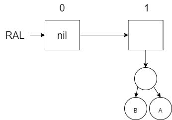

# Random Access Lists

The lists that we have used in this course have been linked lists.  If we want to find something in the list, we have to search resulting in O(n) performance.  We could use a binary search tree or a min heap to help us find things better but then we lose the order in which items were added.  In other languages, we use dynamic arrays such as the python list the java ArrayList or the C++ vector.  These dynamic arrays provide O(1) lookup.  In a purely functional language, this is not possible.  However, an improved solution over the linked list is the Random Access List (RAL).

## Binary Numbers and the RAL

In Erlang, there is not a way to quickly access a specific index in a list with O(1).  In Part 3, you will explore the performance of the `nth` function that Erlang provides to do this.  The difficulty is that we have to traverse through the entire list from beginning to the target index.  To improve on this, we would like to find an O(log n) solution that maintains the order of the values.  O(log n) makes us think about binary search trees.  However, we need to store information in the trees that keeps the order the same.  Binary Search Trees  sacrifice order for performance.

To find a solution, we will consider a problem that at first does not seem related.  Consider binary numbers (purposefully with leading zeros) going from 1 to 7:  001, 010, 011, 100, 101, 110, and 111.  When we want to add 1 to our number, we will go from right to left and do one of the following:

* If we encounter a 0, we will replace it with a 1 and make no more changes.
* If we encounter a 1, we will replace it with a 0 and consider these two steps again for the next number in the sequence.  In this case we are mathematically carrying the 1 to the next item in the sequence.  

If we try to do this in Erlang, we will be frustrated by the fact that we are going from right to left.  Since it is more natural in Erlang to go left (index 0) to right, we will flip our binary numbers around.  

|Base 10 Value|Right to Left|Left to Right (Use in Erlang)|
|-|-|-|
|1|001|100|
|2|010|010|
|3|011|110|
|4|100|001|
|5|101|101|
|6|110|011|
|7|111|111|

Here is the specification and definition for incrementing a binary sequence (going left to right in big endian format) where the sequence starts at 1 and the sequence is stored in a list.  Note that the definition follows the two rules for incrementing a binary sequence that we identified earlier.  An empty list would represent the value of 0.

:::: {.formulabox data-latex=""}
$spec ~ ~ inc :: [integer] \rightarrow [integer].$

$de\mathit{f} ~ ~ inc :: [] \rightarrow [1];$

$de\mathit{f} ~ ~ inc :: [0|Rest] \rightarrow [1|Rest];$

$de\mathit{f} ~ ~ inc :: [1|Rest] \rightarrow [0|( inc ~ ~ Rest)].$
::::
$\nonumber$

The erlang code is shown below:

```erlang
inc([]) -> [1];
inc([0|Rest]) -> [1|Rest];
inc([1|Rest]) -> [0|inc(Rest)].

test() ->
	lists:foldl(
		fun(_Value,Acc) -> 
			X=inc(Acc), 
			io:format("~p~n",[X]), 
			X 
		end, [], lists:seq(1,15)),
	pass.
```
The result of running the test code up to 15 (1111) is shown below:

```shell
[1]
[0,1]
[1,1]
[0,0,1]
[1,0,1]
[0,1,1]
[1,1,1]
[0,0,0,1]
[1,0,0,1]
[0,1,0,1]
[1,1,0,1]
[0,0,1,1]
[1,0,1,1]
[0,1,1,1]
[1,1,1,1]
```
Now that we can build these binary sequences, lets observe what each "1" represents.  Notice that when you write binary numbers, each "1" represents $2^n$ possible values.  In other words, we could say that each "1" is storing those values for us.  In the following binary sequence (written left to right as we did before): 1011, the 1's represent: $2^0$, $2^2$, and $2^3$ for a total of 13.  In other words we could say that 1011 represents 13 different things.  

To see those 13 different things, we will represent each 1 by a tree.  These trees will be special in that each tree will have $2^n$ leaves where $n$ represents the index in the binary sequence (starting at 0).  Trees with $2^n$ leaves are not hard to build.  A complete and balanced tree of height 2 will have $2^2$ leaves, a tree with height 3 will have $2^3$ leaves, and so on.  Here is the representation of 1011 (or 13) using these trees:


Notice that the 0's are represented with $nil$ instead of a tree.  We call this list of trees a Random Access List (RAL).  When you look at this list of trees, you will notice there are a grand total of 13 leaves.  Each of these leaves represent the actual 13 pieces of data in the RAL.  All the other nodes in the tree including the $nil$ values in the list represent the organization of the RAL to enable the O(log n) behavior.  If you wanted to go to one of these leaves, you could traverse the sequence from left to right (which would be O(log n)) and then traverse down to one of the leaves (which would also be O(log n)).  We will explore how this works in the next section.  

To add new items to a RAL, we will use a similar algorithm for adding one to our binary sequence:

* If we encounter a $nil$ (think a 0 in the binary sequence), we will replace it with a tree (think a 1) containing $2^n$ (where is $n$ is our current index) leaves and make no more changes.  The tree that we add will either be a tree of height 1 (if the RAL was previously empty) or it will be a tree that was carried over from the recursive call in the next step below.
* If we encounter a tree (not $nil$, think a 1 in the binary sequence), we will replace it with a $nil$ (think 0) and carry the tree to the next sequence and recursively consider these two steps again.   If a tree was carried over, then we have to carry both the tree(s) from the previous sequence position(s) along with this position.

Let's visually look at how this works first as we store letters in a RAL starting with an empty RAL.  Notice that when we add a new letter to our RAL, it will prepend it to the front just like adding a new digit to a binary sequence.  In each diagram, a non-leaf node is left empty and the leaf nodes contain the actual data. Remember that each tree must be balanced and complete with $2^n$ leaves each.

Add A to an empty RAL:


Add B to the RAL (will require a replacement of the first tree with a $nil$ and merge the new tree with B and the former tree with A):



Add C to the RAL (there is a space to put the new tree with C):


Add D to the RAL (have to merge the C and D and then merge it with the B/A tree and then put it in the next available spot to the right):


Add E (space exists for that in index 0):


Add F (merge the new tree with F and the the tree with E ... notice that the binary number shown above the boxes is increasing like our first binary example):


Add G (which has an available space):


Finally add H (which requires us to merge our new tree with H along with the other 3 trees to create the new tree in index 3).


To create the RAL in software, we will need a structure to represent each of the trees in the list.  The root node of each of the trees will be represented by a $ral\_tree$ node.  Our structure distinguishes between non-leaf nodes (no values) and leaf nodes (values).  The non-leaf nodes called $node$ will include a reference to the left and right sub-trees as well as a $Count$.  The $Count$ will represent the number of leaves under this node.  The $Count$ of a leaf node will always be 1.  We store the $Count$ in each non-leaf node to make it easier to merge a $ral\_tree$ with another $ral\_tree$.  We will also use this $Count$ when trying to access values in our RAL by index later on.

:::: {.formulabox data-latex=""}
$struct ~ ~ ral\_tree$

$\quad \quad \lbrace atom(node), integer:Count, ral\_tree:Le\mathit{f}t, ral\_tree:Right \rbrace ~ ~ or$

$\quad \quad \lbrace atom(lea\mathit{f}), a:Value \rbrace.$
::::
$\nonumber$

The RAL will be represented by a list of $ral\_tree$ objects.  Our `prepend` function will use the following specification and definition:

:::: {.formulabox data-latex=""}
$spec ~ ~ prepend :: a ~ ~ [ral\_tree] \rightarrow [ral\_tree].$

$de\mathit{f} ~ ~ prepend :: Value ~ ~ RAL \rightarrow (merge ~ ~ \lbrace lea\mathit{f}, Value \rbrace ~ ~ RAL).$
::::
$\nonumber$

The `merge` function is responsible for implementing the two rules just like `inc` was used to implement the two similar rules with the binary sequence.  The $\lbrace leaf, Value \rbrace$ will be merged (or carried) into the existing RAL (or binary sequence).  Here is the specification and definition for the `merge` function.  Compare and contrast this with the `inc` function we wrote earlier.  When we have to merge (or carry over) a tree with an existing tree, we create a new root node and put the carry over tree to the left and the existing tree to the right.  The $Count$ for the new root node of the tree will be the sum of the counts of the two trees that were merged together.  Refer back to the diagrams earlier to see how this merge was happening as we added a new letter to our RAL.

:::: {.formulabox data-latex=""}
$spec ~ ~ merge :: ral\_tree ~ ~ [ral\_tree] \rightarrow [ral\_tree].$

$de\mathit{f} ~ ~ merge :: Carry\_Tree ~ ~ [] \rightarrow [Carry\_Tree];$

$de\mathit{f} ~ ~ merge :: Carry\_Tree ~ ~ [nil|Rest\_Trees] \rightarrow [Carry\_Tree|Rest\_Trees];$

$de\mathit{f} ~ ~ merge :: Carry\_Tree ~ ~ [Tree|Rest\_Trees] \rightarrow$

$\quad \quad Merged\_Tree = \lbrace left\_as\_an\_exercise \rbrace,$

$\quad \quad [nil|(merge ~ ~ Merged\_Tree ~ ~ Rest\_Trees)].$
::::
$\nonumber$

The `count` function will be need to determine the new count of the `Merged_Tree`.  The `count` function will either return 1 for a leaf or the $Count$ value from the `ral_tree` structure.  The implementations of all of these functions in Erlang is left for an exercise.

:::: {.problembox data-latex=""}
**Problem Set 1**
  
Starting Code: `prove10_1/src/prove10_1.erl`

1.  Implement the `prepend`,  `merge`, and `count` functions as described above.  The specification and definition for `prepend` and `merge` are provided.  You will need complete the definition for `merge` by determining what `Merged_Tree` should be equal to.  The specification and definition for `count` is not provided but it is described at the end of the reading above.  Use the test code provided to verify your implementation.
::::

## Lookup and Update

Finding a specific value in the RAL relies on the relation to the binary sequence that we started with.  The diagram below shows the RAL with 7 items (111 binary sequence).  In this diagram, the numbers in the non-leaf nodes show the value of $Count$ (remember a leaf node has a $Count$ of 1).  The boxes in the list are also annotated with the power of 2 that they represent.  Note that the power of 2 represents the number of leaves in the $ral\_tree$.


If we wanted to find the 5th number (index 4) in the RAL (where the G in the first leaf on the left is considered index 0), then we first need to traverse the list to find the correct $ral\_tree$.  If we start at the first $ral\_tree$, we see that the $Count$ is 1 which means there is only 1 value in this first $ral\_tree$.  Index 4 is not in this $ral\_tree$.  We will subtract 1 from our Index and keep moving.  


We then consider whether the value we are looking for is within the 2nd node of the RAL.  Our updated index of 3 is $\geq$ to $2^1$ so we subtract $2^1$ from our index and move on.


We then consider whether the value we are looking for is within the 3rd node of the RAL.  Our updated index of 1 is not $\geq$ to $2^2$.  Therefore we know that the value we are looking for is somewhere within the this 3rd $ral\_list$.

The specification and definition for the lookup function is give below.  Note that the `lookup_in_tree` function is used to find the desired value (i.e. leaf) in the `ral_tree`.  

:::: {.formulabox data-latex=""}
$spec ~ ~ lookup :: integer ~ ~ [ral\_tree] \rightarrow a.$

$de\mathit{f} ~ ~ lookup :: Index ~ ~ RAL \rightarrow nil ~ ~ \text{when} ~ ~ Index < 0;$

$de\mathit{f} ~ ~ lookup :: Index ~ ~ [] \rightarrow nil;$

$de\mathit{f} ~ ~ lookup :: Index ~ ~ [nil|Rest\_Trees] \rightarrow (lookup ~ ~ Index ~ ~ Rest\_Trees);$

$de\mathit{f} ~ ~ lookup :: Index ~ ~ [Tree|Rest\_Trees] \rightarrow (lookup ~ ~ Index-(count ~ ~ Tree) ~ ~ Rest\_Trees)$

$\quad \quad \text{when} ~ ~ Index \geq (count ~ ~ Tree);$

$de\mathit{f} ~ ~ lookup :: Index ~ ~ [Tree|Rest\_Trees] \rightarrow (lookup\_in\_tree ~ ~ Index ~ ~ Tree).$
::::
$\nonumber$

In the definition, the first two clauses handle invalid index scenarios.  The third clause handles the case where as we are going through the RAL list, we come across a $ral\_tree$ that is $nil$.  We know there are no values in there, so we keep going.  Notice that we don't decrease our $Index$ because there were not any values (or leaves) in that $ral\_tree$.  In the fourth clause, there are values in the $ral\_tree$ but we haven't arrived at the $ral\_tree$ for our $Index$ value yet.  In the fifth case, we have found the target $ral\_tree$ and we will use `lookup_in_tree` to find the specific leaf.

We now have to traverse the $ral\_tree$ to find the leaf associated with our Index value.  In our previous example, the $Index$ was equal to 3 when we found our target $ral\_tree$.  We will use that $Index$  to find our leaf.  The process is as follows:

1. If the current node of the $ral\_tree$ is a $leaf$, then we have found our value (this is true because we assume that the $ral\_tree$ was created correctly in the first place).
2. If the current node of the $ral\_tree$ is a $node$, then we have to either go left or right:
	* If the current $Index$ is $<$ the $Count / 2$ (number of leaves on either side of the current node), then keep looking towards the left.
	* If the current $index$ is $\geq$ the $Count / 2$, then keep looking towards the right.  In this case, we need to subtract off $Count / 2$ from the $Index$ because the $Count$ values of children nodes will be relative to the parent node.

The definition and implementation of the `lookup_in_tree` function based on this process will be left for an exercise.

If we wanted to update a value in the RAL, the process is almost the same as looking up a value.  The `update` function will be just like the `lookup` function and the `update_in_tree` function will be just like the `lookup_in_tree` function.   The table below shows the differences:

|lookup|update|lookup_in_tree|update_in_tree|
|-|-|-|-|
|Search for the $ral\_tree$ based on the $Index$.  When found, return the value returned from `lookup_in_tree`.| Search for the $ral\_tree$ based on the $Index$.  Rebuild the RAL list from left to right (like an `insert_at` function) until the $ral\_tree$ is found.  When found, use the updated $ral\_tree$ returned from `update_in_tree`.  The remaining RAL list is reused.|Use the $Index$ to traverse the tree left and right until the value is found.  Return the value in the $leaf$ that was found.|Use the $Index$ to traverse the tree left and right.  Rebuild the tree (in the same way as was done with the Binary Search Tree) starting with the $leaf$ using the new modified value.

The definition for `update` is provided below.  The definition and implementation of the `update_in_tree` is left as an exercise.

:::: {.formulabox data-latex=""}
$spec ~ ~ update:: integer ~ ~ a ~ ~ [ral\_tree] \rightarrow [ral\_tree].$

$de\mathit{f} ~ ~ update:: Index ~ ~ Value ~ ~ RAL \rightarrow RAL ~ ~ \text{when} ~ ~ Index < 0;$

$de\mathit{f} ~ ~ update:: Index ~ ~ Value ~ ~ [] \rightarrow [];$

$de\mathit{f} ~ ~ update:: Index ~ ~ Value ~ ~ [nil|Rest\_Trees] \rightarrow (update ~ ~ Index ~ ~ Value ~ ~ Rest\_Trees);$

$de\mathit{f} ~ ~ update:: Index ~ ~ Value ~ ~ [Tree|Rest\_Trees] \rightarrow$

$\quad \quad [Tree|(update ~ ~ Index-(count ~ ~ Tree) ~ ~ Value ~ ~ Rest\_Trees)]$

$\quad \quad \text{when} ~ ~ Index \geq (count ~ ~ Tree);$

$de\mathit{f} ~ ~ update:: Index ~ ~ Value ~ ~ [Tree|Rest\_Trees] \rightarrow$

$\quad \quad [(update\_in\_tree ~ ~ Index ~ ~ Value ~ ~ Tree)|Rest\_Trees].$
::::
$\nonumber$

Notice that an additional difference is that the `update`  function will return the original RAL if the index is incorrect.

:::: {.problembox data-latex=""}
**Problem Set 2**

Starting Code: `prove10_2/src/prove10_2.erl`

1. Implement `lookup` and `lookup_in_tree` based on the descriptions above. You will need to copy the `prepend`, `merge`, and `count` functions from the previous problem set.
2. Implement `update` and `update_in_tree` based on the descriptions above.  
::::

$\nonumber$
$\nonumber$
[](http://creativecommons.org/licenses/by/4.0/)

