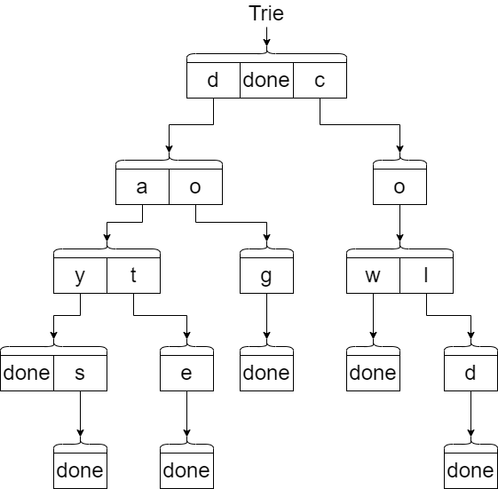

# Tries

When we look at all of the forms of trees (including heaps) we notice that the placement of values is highly dependent on the result of comparing two values.  While comparing two integers can be an easy thing to do, the comparison of two string is more complicated.  Comparing strings is a frequent activity performed in our software but consider the fact that string comparisons at worst will require the comparison of multiple characters each time.  If our strings were stored in a binary search tree, we would need to compare our target string with several other strings until we found a match.  The Trie data structure provides a tree structure which is intended to store strings in such a way that searching is faster and potentially memory storage is optimized.

## Creating the Trie

The diagram below shows an example of a Trie that stores words.  Notice that the Trie begins with an empty character string and then branches out to all valid first letters for the values that are stored.  Each branch represents a single letter.  To find the words that are stored, you start at the root and progress downwards until you get to a letter that has `done` as a child.  In many cases, additional words can be found by following other letters instead of stopping at the `done`.  This Trie includes the words: "day", "date", "days", "", "cow", "cold", "dog".  Notice that since "" is in the Trie, that there is a `done` child connected to the root. 


When adding a new word, we start at the root and go one letter at a time.  If the letter already exists in the Trie, then we goto the next letter.  If the letter does not exist, then we create a child for that letter.  The subsequent letters will all be new children.

Unlike the binary search tree, the Trie can have a variable number of children.  We can store those variable number of children in any data structure.  For simplicity, we will use a dictionary as follows:

:::: {.formulabox data-latex=""}
$struct ~ ~ node$

$\quad \quad \lbrace string:Letter \looparrowleft node \rbrace ~ ~ or$

$\quad \quad \lbrace atom(done) \looparrowleft atom(nil) \rbrace.$
::::
$\nonumber$

The diagram below shows the same early Trie but with the perspective of dictionaries.  Each set of boxes represents a separate dictionary.  The arrows represent the $node$ value associated with each key in the dictionary.



Here is the specification for our add function:

:::: {.formulabox data-latex=""}
$spec ~ ~ add :: string ~ ~ node \rightarrow node.$
::::
$\nonumber$

When adding to the Trie, there are three scenarios that we must cover:

1. Add a word into an empty Trie - this will require that we create our root node for the empty character.  From this new root node, we will begin to add each letter of the word.
2. Check each letter (we will represent the word as a list of letters)  to see if the letter already exists in the dictionary. 
	* If the letter does exist, then follow that node (the next dictionary) and check for the next letter recursively.
	* If the letter does not exist, then create a new node (with an empty dictionary - $\lbrace \looparrowleft \rbrace$) for the letter and add it the current node dictionary.  Follow that new node for the next letter recursively.  Note that once we have this case, all subsequent letters will be new nodes as well.
3. If we run out of letters, then that means that the node we are on is a terminating node for a word.  The value `done` should be added to the dictionary of this node.  This is the base case.

All three scenarios appear in the definition below.  Note that we are using three functions that we assume exists for a dictionary:
* `contains` - Does the key exist in the dictionary
* `get` - Get the value in the dictionary associated with the key
* `put` - Put the key and value into the dictionary

:::: {.formulabox data-latex=""}
$de\mathit{f} ~ ~ add :: Word ~ ~ nil \rightarrow (add ~ ~ Word ~ ~ \lbrace \looparrowleft \rbrace);$

$de\mathit{f} ~ ~ add :: [] ~ ~ Node \rightarrow Node ~ ~ \text{when} ~ ~ (contains ~ ~ done ~ ~ Node) == true;$

$de\mathit{f} ~ ~ add :: [] ~ ~ Node \rightarrow (put ~ ~ done ~ ~ nil ~ ~ Node);$

$de\mathit{f} ~ ~ add :: [First|Rest] ~ ~ Node \rightarrow(put ~ ~ First ~ ~ (add ~ ~ Rest ~ ~ (get ~ ~First ~ ~ Node) ~ ~ Node) ~ ~$

$\quad \quad \text{when} ~ ~ (contains ~ ~ First ~ ~ Node) == true;$

$de\mathit{f} ~ ~ add :: [First|Rest] ~ ~ Node \rightarrow$

$\quad \quad (put ~ ~ First ~ ~ (add ~ ~ Rest ~ ~ \lbrace \looparrowleft \rbrace) ~ ~ Node)$
::::
$\nonumber$

The implementation of the `add` function will be left for an exercise.

In Erlang, we can use the following code to perform the `contains`, `get` and `put` operations on the dictionary.  In Erlang, a dictionary is called a map  Note that to create an empty map, we use `#{}`.  If we wanted to prefill the map, we could use `#{key1 => value1, key2 => value2, key3 => value3}`.

```erlang
Map = #{"Bob" => 10, "Sue" => 20},

% contains
true = maps:is_key("Bob", Map),
false = maps:is_key("Tim", Map),

% get
10 = maps:get("Bob", Map),
20 = maps:get("Sue", Map),

% put
New_Map = maps:put("Tim", 30, Map),
30 = maps:get("Tim", New_Map),
```

:::: {.problembox data-latex=""}
**Problem Set 1**

You can find the template for the problem sets in this lesson here: [prove11.erl](proves/prove11.erl)

1. Implement the `add` function and use the provided test code to verify the implementation.  In the test code note that the pattern matching is done with `:=` instead of `=>` in Erlang.  Also recall that Erlang will represent a string as a list of characters where each character is stored using the [ASCII table](https://www.asciitable.com/)  integer value.
::::

## Searching and Counting

To search for a word in the Trie, we will check each letter to see if it is contained in the dictionary.  Each check will be a recursive call.  If the current letter is not in the dictionary, then the word does not exist.  When we get through the whole word (base case with []) then we will need to look for `done` in the dictionary.  If `done` does not exist, then the original word does not exist.  

The specification and definition for the `search` function is given below:

:::: {.formulabox data-latex=""}
$spec ~ ~ search :: string ~ ~ node.$

$de\mathit{f} ~ ~ search :: Word ~ ~ nil \rightarrow false;$

$de\mathit{f} ~ ~ search :: [] ~ ~ Node \rightarrow (contains ~ ~ done ~ ~ Node);$

$de\mathit{f} ~ ~ search :: [First|Rest] ~ ~ Node \rightarrow (search ~ ~ Rest ~ ~ (get ~ ~ First ~ ~ Node)) ~ ~$

$\quad \quad \text{when} ~ ~ (contains ~ ~ First ~ ~ Node);$

$de\mathit{f} ~ ~ search :: [First|Rest] ~ ~ Node \rightarrow false.$
::::
$\nonumber$

The Erlang code for `search` function will be left for an exercise.

To count all the words in a Trie, we need to count all the nodes that have a `done` key in the dictionary.  This will require recursion through all the keys in the dictionary.  Prior to recusing through the keys in the dictionary, we will first need to determine if this node has a `done` key.  If it does, then the total count will be 1 plus the whatever is found in the recursive calls to each key in the node dictionary.  Remember that the presence of a `done` key does not mean that there are no other key's in the dictionary.

The specification and part of the definition is give below.  The remaining definition and implementation will be left for an exercise.

:::: {.formulabox data-latex=""}
$spec ~ ~ count :: node \rightarrow integer.$

$de\mathit{f} ~ ~ count :: nil \rightarrow 0;$

$de\mathit{f} ~ ~ count :: Node \rightarrow$

$\quad \quad part\_of\_problem\_set$

$\quad \quad \text{when} ~ ~ (contains ~ ~ done ~ ~ Node) == true;$

$de\mathit{f} ~ ~ count :: Node \rightarrow$

$\quad \quad part\_of\_problem\_set.$
::::

$\nonumber$

:::: {.problembox data-latex=""}
**Problem Set 2**

1.  Implement the `search` function and use the provided test code to verify the implementation.
2.  Implement the remainder of the `count` function and use the provided test code to verify the implementation.  Some additional information:
	* In the starting code provided, you will note the following pattern matching syntax `count(Node = #{done := nil}) ->` which will match if the Node map provided contains a Key called `done` with a value of `nil`.  This will still match even if there are other key value pairs stored in the map.  Note that each time we match this pattern we should be adding 1 to the accumulated count.
	* You may find the `maps:fold` function useful.  In the same way that `lists:foldl` will call a lambda function to obtain an accumulated value from a list of values, the `maps:fold` will call a lambda function to obtain an accumulated value from a list of keys in the map.  The lambda function for the `maps:fold` takes 3 parameters including the Key, Value, and previous Accumulator value.  The `maps:fold` function can be used to iterate recursively through all the key value pairs in the Node map.
::::

## Performance

A Trie has the potential to both run faster and use less memory.  If we had a collection of strings to store and we wanted to maximize performance, the following table can be consulted.  Note that $n$ represents the number of strings and $m$ represents the maximum size of the string.

|Data Structure|Search Timing|Memory|
|-|-|-|
|List|$O(n*m)$ - Have to search each node and compare each letter|$O(n*m)$|
|Binary Search Tree|$O(n*m)$ if unbalanced; $O(m * log ~ n)$ if balanced|$O(n*m)$|
|Red Black Tree|$O(m * log ~ n)$|$O(n*m)$|
|Trie|$O(m)$ - Only have to compare each letter|$O(n*m)$ if no common prefixes; closer to $O(m)$ depending on the amount of prefix commonality|

If the number of strings $n$ keeps increasing, the performance of the Trie will improve over the Red Black Tree.  However, it won't improve by much since the Red Black Tree is logarithmic.  If the size of the string length $m$ is larger, then we will see more noticeable improvements from the Trie over the Red Black Tree.  The Trie is definitely faster than the List or Binary Search Tree.

The memory requirements of the Trie vary based on the amount of compression we get from having common character prefixes.  In the problem set below, you will compare the memory requirements of a collection of phone numbers stored in a List and stored in a Trie.  Phone numbers for a specific geographical region will have common area codes and exchanges.  Similar situations occur with IP addresses in a network.

To measure the memory requirement of a variable in Erlang, we use the following code:

```erlang
List = [1,2,3,4,5],
Size = erts_debug:flat_size(List),
io:format("Size of List = ~p~n",[Size]),
```

In this example, the size of the five element list is 10 heap words.  A heap word is 4 bytes or 32 bits.  So the total memory is 40 bytes.

:::: {.problembox data-latex=""}
**Problem Set 3**

1. Download the file [phone.txt](proves/phone.txt) for use in this problem.  This file contains a list of 80,000 phone numbers with the same area code and eight different exchanges (the 3 digits after the area code).  To increase the size of the common prefix, the international code (+1) along with dashes have been included.  Write test code to compare the memory sizes of these phone number strings stored in both a list and in a Trie.  Note that it may take several minutes to create the Trie.  The function `read_file` has been provided for you which will store each line of the file into an erlang list.  Record your observations in the comments of the test code including the following:
	* Percentage reduction obtained by using a Trie
	* Reason for the reduction
::::
 
$\nonumber$
$\nonumber$
[](http://creativecommons.org/licenses/by/4.0/)
